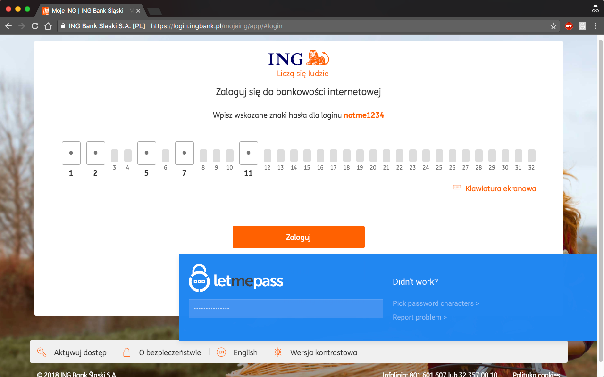

# Let Me Pass browser extension

This repository contains the source code of the Let Me Pass browser extension for Chrome.

## About the extension

Have you ever used a page that asks you for a random selection of individual letters from your password? 
It's bad enough when you remember your password, but when you use a password manager it becomes nigh on impossible!

I use a password manager for all my passwords and one day I just got fed up with copying the long, random passwords to the notepad, just so that I can correctly count the letters in them and log in.
This is how Let Me Pass came to be. Now it supports every bank page in Poland that I could find and a couple of others as well.

The extension shows a pop-up on the page with an input, where you can type (or autocomplete) your password. 
It then automatically maps the letters you typed into the inputs on the page.
If for some reason this doesn't work, you can fall back to picking the password characters yourself - then you still type the password into the single input,
but then you have to select which letters the form requested.

You can install the extension directly from the [Chrome Web Store][webstore].

## Development

Interested in contributing? This is awesome! If at any point you are stuck, feel free to reach out to me [on Twitter][twitter] or
via email (adam [at] pohorecki [dot] pl). I also hang out on the [Clojurians Slack][slack] as @apohorecki.

### Dependencies

You will need to install Google Chrome (or Chromium), JDK and Leiningen. 

### Building (once)

The following command will build the extension to `target/unpacked`.

    ./scripts/build-dev.sh
    
### Running tests

You can run all the tests using this command:

    lein eftest
    
This will run the tests for all the websites supported by Let Me Pass, which takes a fair amount of time.
Alternatively, you may want to run just a single test namespace, which is much more useful when adding support for something, which didn't work before:

    lein eftest password-helper.e2e.ing
    
    
### Release build

To compile the project with advanced optimizations and compress it into an archive you can run this command:

    ./scripts/build-release.sh
    
## Issues and Pull Requests welcome!

If you can't or don't want to add support for another site yourself, feel free to open an issue on GitHub or use the in-app "Report problem" form.

Otherwise, feel free to fork the repo and open a pull request with your changes!

[webstore]: https://chrome.google.com/webstore/detail/let-me-pass/cojakcgheepgdmkdijgghafmfancpgid
[twitter]: https://twitter.com/apohorecki
[slack]: https://clojurians.herokuapp.com/ 
